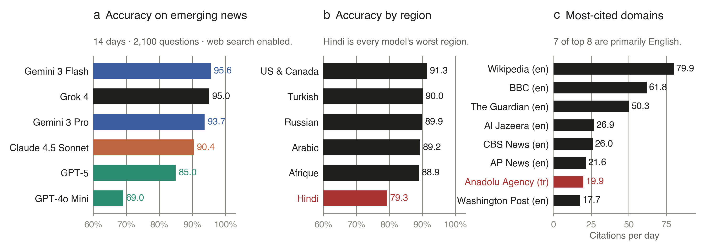

# Evaluating Commercial AI Chatbots as News Intermediaries

[](https://arxiv.org/abs/2605.22785) [](https://suzgunmirac.github.io/ai-as-news-intermediaries/)


**High Accuracy, Uneven Grounding, and Fragile Robustness**

> A fourteen-day, real-time evaluation of six commercial AI chatbots on 12,600 same-day BBC News questions across six languages. The strongest systems answer 94–96% correctly on average, but aggregate accuracy masks a sharp regional gap (Hindi at 79.3%), a retrieval-bottlenecked error structure (~70% of errors trace to retrieval failure or source divergence), opaque source attribution, and acute fragility under subtly imperfect questions (from 88–96% in clean conditions to as low as 19% under adversarial premises).



## Repository contents

```
.
├── ReplicateResults.ipynb            Main results: accuracy, citations, MC vs FR, adversarial
├── ReplicateAblationResults.ipynb    Web-search ablation results
├── ErrorAnalysis.ipynb               Error-taxonomy classification and figures
├── results/                          Per-day, per-region, per-model JSONL outputs
│   └── {region}/{model}/{date}_outputs.jsonl
├── ablation/                         Web-search-disabled runs and error-taxonomy inputs/outputs
├── figures/                          Canonical figure outputs (PDF + PNG)
└── figures_ablation/                 Canonical figures for the ablation analysis
```

Each line in `results/{region}/{model}/{date}_outputs.jsonl` is one model–question instance with the prompt, the article URL, the correct answer, and the model's full response.

## Reproducing the figures

The three notebooks regenerate every figure and number in the paper directly from the JSONL outputs in `results/` and `ablation/`.

```bash
# 1. Install dependencies (Python 3.10+)
pip install jupyter pandas numpy matplotlib seaborn tqdm

# 2. Run notebooks top-to-bottom
jupyter notebook ReplicateResults.ipynb
jupyter notebook ReplicateAblationResults.ipynb
jupyter notebook ErrorAnalysis.ipynb
```

Outputs land in `figures/` and `figures_ablation/`. No model API calls are required to reproduce the paper figures; the JSONL files contain the full evaluation outputs already.

## Re-running the evaluation (optional)

The data-collection pipeline (BBC scraping, question generation, model querying) is not included here because it depends on day-of news availability. The evaluation outputs in `results/` are the canonical artifact for replicating the paper's analyses.

## Citation

```bibtex
@article{suzgun2026news,
  title   = {Evaluating Commercial AI Chatbots as News Intermediaries},
  author  = {Suzgun, Mirac and Shen, Emily and Bianchi, Federico and
             Spangher, Alexander and Icard, Thomas and Ho, Daniel E. and
             Jurafsky, Dan and Zou, James},
  journal = {arXiv preprint arXiv:2605.22785},
  year    = {2026}
}
```
